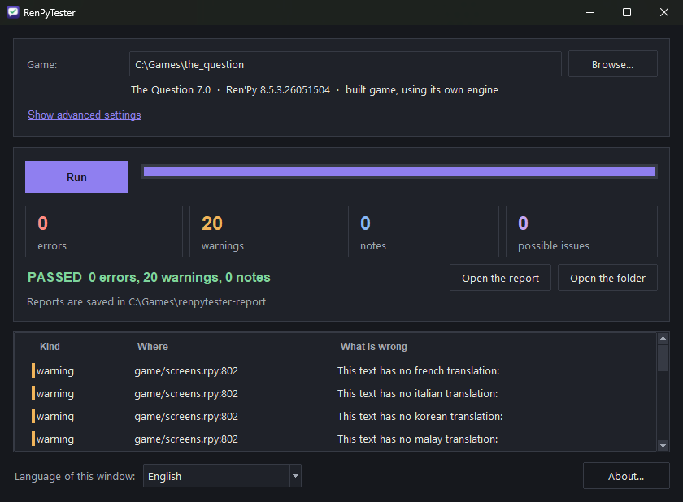
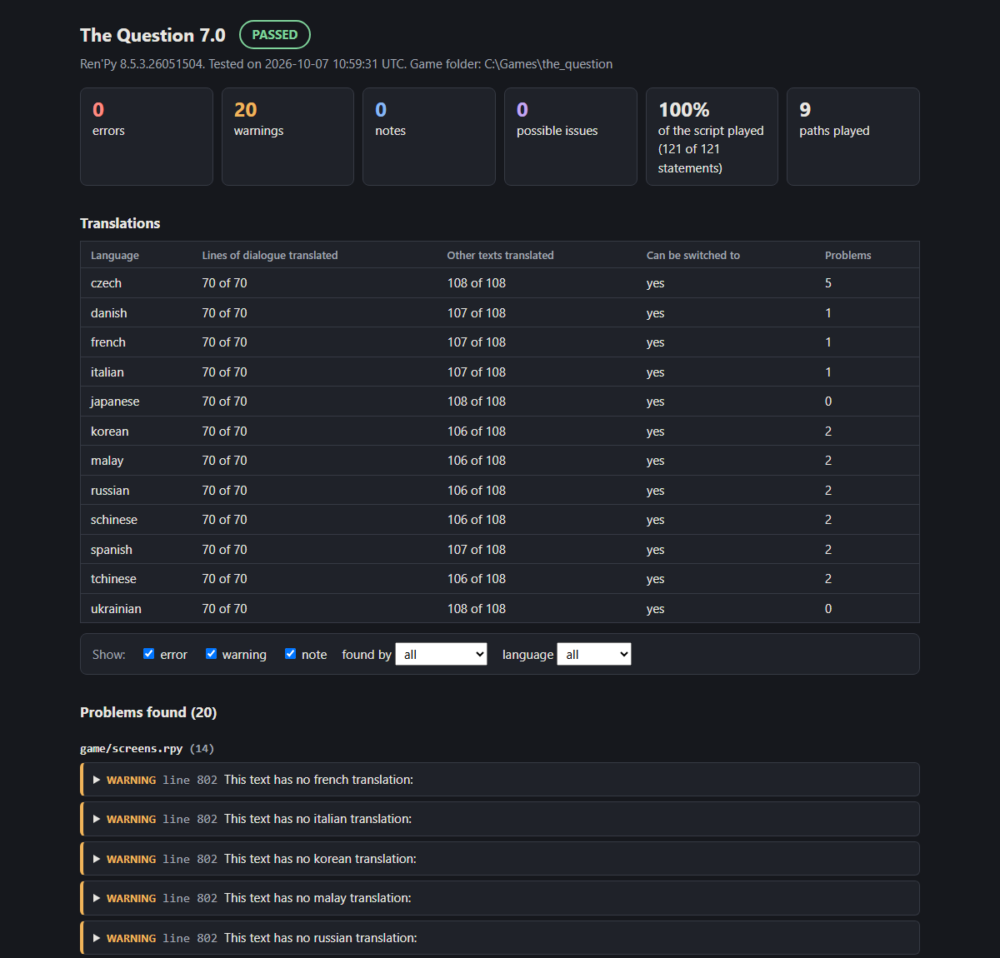

# RenPyTester

RenPyTester plays through a Ren'Py game by itself and tells you what is broken: crashes, missing pictures and sounds, broken translations and broken menu screens, each with the file and line where it happened.

You give it the folder of a game; it does the rest.
No window of the game appears while it works, and the game's folder is left exactly as it was.
It works on any Ren'Py 8 game, finished or still being made.



## 1. Get it

Pick one of the two ways.

### The simple way: download the program

Go to the [latest release](https://github.com/CyBearNairus/RenPyTester/releases/latest) and download the file for your system.
Nothing has to be installed, not even Python.

| Your system | File to download |
| --- | --- |
| Windows | `renpytester-windows-x64.exe` |
| Linux | `renpytester-linux-x64` |
| macOS, Apple Silicon (M1 and later) | `renpytester-macos-arm64` |
| macOS, Intel | `renpytester-macos-x64` |

On Windows, the first time you open it you may be told that the program is from an unknown publisher, because it is not signed: choose *More info*, then *Run anyway*.
On Linux and macOS, allow the file to run first: `chmod +x` followed by the file's name.

### From the source

You need [Python](https://www.python.org/downloads/) 3.11 or later, and nothing else.
Download this repository (the green *Code* button, then *Download ZIP*, and unpack it), or clone it:

```text
git clone https://github.com/CyBearNairus/RenPyTester.git
cd RenPyTester
```

## 2. Test your game

### With the window

Double-click the program you downloaded.
From the source, open a terminal in the repository's folder and type:

```text
python -m renpytester
```

Then:

1. Press *Browse...* and choose your game's folder.
2. If the game is a project that you open with the Ren'Py launcher, you are also asked for the folder of your Ren'Py SDK. A game built for players has its own engine and needs nothing more.
3. Press *Run* and wait for the bar to fill.

The window then says whether the game passed and lists what was found.
*Open the report* shows everything in your browser.

### With one command

To start a test without the window, give the game's folder, shown here as `PATH_TO_GAME`:

```text
python -m renpytester PATH_TO_GAME
```

For a project that you open with the Ren'Py launcher, add the SDK:

```text
python -m renpytester PATH_TO_GAME --sdk PATH_TO_RENPY_SDK
```

With a downloaded program, write its name in place of `python -m renpytester`.
On Windows that is `renpytester-windows-x64-console.exe`, a second file on the release page made for terminals and build servers.

## 3. Read the result

Every run saves a report that opens in any browser, with no internet connection needed.
The window and the terminal both say where it was saved.



- **Errors** are things that are broken, such as a crash or a missing file. A game with errors has *failed*.
- **Warnings** are things worth a look, such as a line with no translation.
- **Notes** are for your information.
- **Possible issues** were found in a part of the game the tool had to reach in an unusual way, so a player may never meet them.

Click a problem in the report to see how to get to it in the game: the choices that were made on the way.

## More

Everything else is in [docs/advanced.md](docs/advanced.md): all the options, choosing what is checked and in which languages, the settings file, testing a copy of a game that writes its own files, use on a build server, and the exit codes.
The format of the JSON report is in [docs/report-schema.md](docs/report-schema.md).

RenPyTester is free software under the [GPL-3.0 licence](LICENSE).
